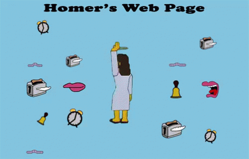
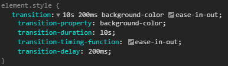

# Transiciones y animaciones

Antes de implementar una transicion o animacion, nos podemos preguntar cuando o para qué puedo usar estas herramientas, estas son algunas de las respuestas:

- Proporcionar información visual cuando se interactúa con un elemento.
- Destacar las relaciones entre los elementos.
- Destacar la disponibilidad de una acción.
- Destacar los resultados de una acción.
- Revelar informacion escondida como menues o *tooltips*.
- Centrar la atención en lo que es importante, sin crear distracciones innecesarias.
- Agregar carácter a las interacciones comunes.

Las animaciones deben llamar la atención... pero no demasiado. Hay que asegurarse de que el movimiento no requiera demasiado tiempo y no dure demasiado en la pantalla. Este es especialmente el caso si hablamos de elementos con los que los usuarios deberían interactuar con frecuencia. Una o dos veces puede ser divertido, pero con un uso frecuente puede volverse realmente frustrante.

Hay lindos ejemplos en la documentacion de material design https://material.io/design/motion/understanding-motion.html

TLDR: No queremos llegar a esto:




## Las transiciones

Las transiciones no son otra cosa que el efecto de un cambio en el estado de un elemento de forma gradual en un intervalo de tiempo. Cuando hablamos de cambio de estado nos referimos a cambios en los valores de sus propiedades.


Este tipo de efectos producen en una página la sensación de que está *"viva"*.

### Sintaxis

Podemos definir las propiedades individuales de transición o usar usar la propiedad abreviada.

Utilizando las propiedades individuales:
```css
div {
    width: 100px;
    height: 100px;
    background: red;

    transition-property: width;
    transition-duration: 2s;
    transition-delay: 800ms;
    transition-timing-function: ease;
}
```

Utilizando la propiedad abreviada:
```css
div {
    width: 100px;
    height: 100px;
    background: red;

    transition: width 2s 800ms ease;
}
```

Los valores no son obligatorios y el orden de los valores solo importa si ponemos un valor de *delay*, que en ese caso hay que ponerlo despues del valor de *duration*.




### Ejemplo Articulos

Para los ejemplos lo que vamos a hacer es tomar prestado otros ejemplos y darle vida con transiciones.

Para el primer caso voy a tomar el ejemplo donde aprendieron sobre *padding* y darle una transición.


#### Preparaciones previas

Para este ejemplo quiero poder poner foco en los distintos articulos, tanto con la tecla tab o con un click. Para esto necesito agregar un tabindex a cada contenedor en orden creciente.

```html
<section class="container" tabindex="1">
...
</section>

<section class="container" tabindex="2">
...
</section>

<section class="container" tabindex="3">
...
</section>
```

Esto me permite definir:

```css
section.container {
    margin: 0px auto;
    /* Por defecto tiene padding: 0; */
}

section.container:focus {
    padding: 40px 0;
}
```

Y asi va quedando:


#### Agregandole la transición

Ahora si que tengo el estado inicial y el estado final puedo agregarle la transición:

```css
section.container {
    margin: 0px auto;
    transition-property: padding;
    transition-duration: 0.4s;
    transition-timing-function: ease-in-out;
}

section.container:focus {
    outline: none; /* Le saco el borde que el focus me pone por defecto */
    padding: 40px 0;
}
```

Y asi queda:


[Ejemplo en vivo](https://uqbar-project.github.io/css-12-transiciones-y-animaciones/muchosArticulos.html)

### Consola de animaciones

En muchos casos puedo querer ver la animación en detalle o editarlas en tiempo real y en ese caso existe las herramientas de animación de firefox y chrome

En el caso de chrome:


En el caso de firefox:


### Ejemplo Variables

En este ejemplo por suerte ya tenemos definido dos estados y vamos a expandir sobre eso

```css
.primario {
    background-color: var(--color-secundario);
    color: var(--letra-primario);
    height: 3rem;
    width: 10rem;
    border-radius: var(--border-radius-default);
}

.primario:hover {
    filter: brightness(75%);
}
```


Empecemos transicionando el brillo

```css
.primario {
    background-color: var(--color-secundario);
    color: var(--letra-primario);
    height: 3rem;
    width: 10rem;
    border-radius: var(--border-radius-default);
    transition: filter 200ms 100ms;
}

.primario:hover {
    filter: brightness(75%);
}
```


Y ya podriamos decir que terminamos... no? No!


```css
.primario {
    background-color: var(--color-secundario);
    color: var(--letra-primario);
    height: 3rem;
    width: 10rem;
    border-radius: var(--border-radius-default);
    cursor: pointer;
    transition: all 200ms 100ms, box-shadow 1s 100ms ease-in-out;
}

.primario:hover {
    --letra-primario: white;
    --color-secundario: red;
    font-size: 20px;
    filter: brightness(75%);
    transform: scale(1.5);
    box-shadow: 0px 0px 6px 4px grey;
}
```

Notece que transiciona valores por cambios en variables y tambien transiciona con valores no definidos ya que toma los valores por defecto.


Mmm capaz es un poco mucho...

[Ejemplo en vivo](https://uqbar-project.github.io/css-12-transiciones-y-animaciones/variables.html)

### Propiedades

#### *transition-property*:
Especifica el nombre de la propiedad a la cual ponerle un efecto de transicion.

```css
.class {
    transition-property: background-color;
}
```

Se pueden espificar propiedades compuestas.
```css
.class {
    /* Incluira padding-top padding-right padding-bottom padding-left */
    transition-property: padding;
}
```

Otra opcion es incluir todas las propiedades.
```css
.class {
    transition-property: all;
}
```

#### *transition-duration*:
Especifa cuanto tiempo tomara la transición entre dos estados diferentes. Utiliza las unidades `s`
para segundos y `ms` para milisegundos.


#### *transition-delay*:
Especifa cuanto tiempo tomara la transición en empezar. Al igual que *transition-duration* utiliza las unidades `s`
para segundos y `ms` para milisegundos.


#### *transition-timing-function*:
Esto permite establecer una curva de aceleración para que la velocidad de la transición pueda variar a lo largo de su duración. Hay que aclarar que aunque se modifique la aceleración la duracion permanecera intacta.

Un ejemplo modificando su valor desde la consola de chrome.


Tambien se puede en Firefox


#### Multiples transiciones

Puedo crear multiples transiciones si separo las propiedades con una coma. Es necesario definir todas las otras propiedades con coma ya que tomara el siguiente valor definido y volvera al primer valor en caso de no tener otro.
```css
.class {
    transition-property: padding, padding-top, color, background-color;
    transition-duration: 2s, 0s, 200ms;
    transition-delay: 0s, 800ms;
    transition-timing-function: ease-in-out;
}
```
Que seria equivalente a
```css
.class {
  transition: padding 2s 0s ease-in-out,
        padding-top 0s 800ms ease-in-out,
        color 200ms 0s ease-in-out,
        background-color 2s 800ms ease-in-out;
}
```

## Las animaciones

Las animaciones son bastante parecidas a las transiciones. Ambas tienen en común que actuan sobre los valores de las propiedades de un elemento transformándolos gradualmente en otros valores. Sin embargo, las animaciones ofrecen bastante más control que las transiciones en el proceso de transformación del elemento.

### Sintaxis

Al igual que las trnasiciones definir las propiedades individuales o usar usar la propiedad abreviada.

Utilizando las propiedades individuales:
```css
div {
    animation-name: mi-animacion;
    animation-duration: 5s;
    animation-timing-function: linear;
    animation-delay: 0.2s;
    animation-iteration-count: infinite;
    animation-direction: normal;
    animation-fill-mode: forwards;
}
```

Utilizando la propiedad abreviada:
```css
div {
  animation: mi-animacion 5s linear 0.2s infinite normal forwards;
}
```

Ningun valor es obligatorio y cada propiedad tiene un valor por defecto.

### Keyframes

A diferencia de las transiciones no se espera a que suceda un cambio en el estado del elemento. Por eso para usar animaciones necesitamos *keyframes* que describirán el comportamiento que tendrá la animación durante su periodo de ejecución.

Se definen de la siguiente manera:

```css
@keyframes mi-animacion {
    0% {
        width: 10px;
        height: 10px;
        background-color: red;
	}
    25% {
        width: 200px;
	}
    50% {
        height: 200px;
    }
    75% {
        width: 100px;
        height: 100px;
    }
    100% {
        width: 200px;
        height: 100px;
        background-color: green;
    }
}
```

Asi se veria la animación aplicada a un elemento


[Ejemplo en vivo](https://uqbar-project.github.io/css-12-transiciones-y-animaciones/keyframes.html)

### Ejemplo animación inicial

En este ejemplo vamos a tomar el ejemplo de medidas espaciales y vamos a agregar una animación de inicio que puede servir para presentar la informacion secuencialmente al usuario.


Vamos a utilizar una animación reutilizable a todos los elementos que quiera.

```css
@keyframes aparecer {
  0% {
    opacity: 0;
    transform: translate(100px, 0);
  }
  25% {
    opacity: 0;
  }
  100% {
    transform: translate(0, 0);
    opacity: 1;
  }
}
.material_elemento,
.video_contenedor,
.testimonio_elemento,
hr {
  animation: aparecer 1.2s;
}
```


Una de las ventajas que podemos observar es que la animacion empieza a reproducir cuando termina de cargar los elementos. Ahora puedo controlar el orden en el cual se muestran individualmente.

```css
.material_elemento,
.video_contenedor,
.testimonio_elemento,
hr {
    animation: aparecer 1.2s;
    animation-fill-mode: both; /* Necesario para que los elementos tomen los valores iniciales durante el delay */
}
.material_elemento:nth-child(1) {
    animation-delay: 0;
}
.material_elemento:nth-child(2) {
    animation-delay: 0.5s;
}
.material_elemento:nth-child(3) {
    animation-delay: 1s;
}
hr:nth-of-type(1),
.video_contenedor {
    animation-delay: 1.5s;
}
hr:nth-of-type(2),
.testimonio_elemento:nth-child(1) {
    animation-delay: 2s;
}
.testimonio_elemento:nth-child(2) {
    animation-delay: 2.5s;
}
.testimonio_elemento:nth-child(3) {
    animation-delay: 3s;
}
```

Y asi queda la carga inicial de la página:


### Propiedades


## Docs
[https://developer.mozilla.org/es/docs/Web/CSS/transition](https://developer.mozilla.org/es/docs/Web/CSS/transition)

[https://www.w3schools.com/cssref/css3_pr_transition.asp](https://www.w3schools.com/cssref/css3_pr_transition.asp)

[https://www.adictosaltrabajo.com/2012/07/09/css3-transiciones-animaciones/](https://www.adictosaltrabajo.com/2012/07/09/css3-transiciones-animaciones/)

[https://www.w3schools.com/cssref/css3_pr_animation.asp](https://www.w3schools.com/cssref/css3_pr_animation.asp)

[https://animista.net/](https://animista.net/)

[https://material.io/design/motion/understanding-motion.html](https://material.io/design/motion/understanding-motion.html)

[https://www.elegantthemes.com/blog/tips-tricks/when-it-makes-sense-to-use-animations-in-web-design](https://www.elegantthemes.com/blog/tips-tricks/when-it-makes-sense-to-use-animations-in-web-design)

[https://uxdesign.cc/the-ultimate-guide-to-proper-use-of-animation-in-ux-10bd98614fa9](https://uxdesign.cc/the-ultimate-guide-to-proper-use-of-animation-in-ux-10bd98614fa9)